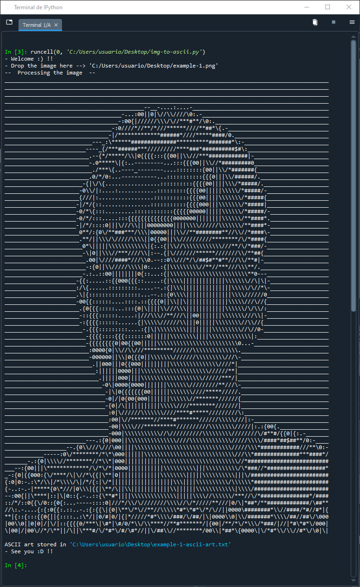
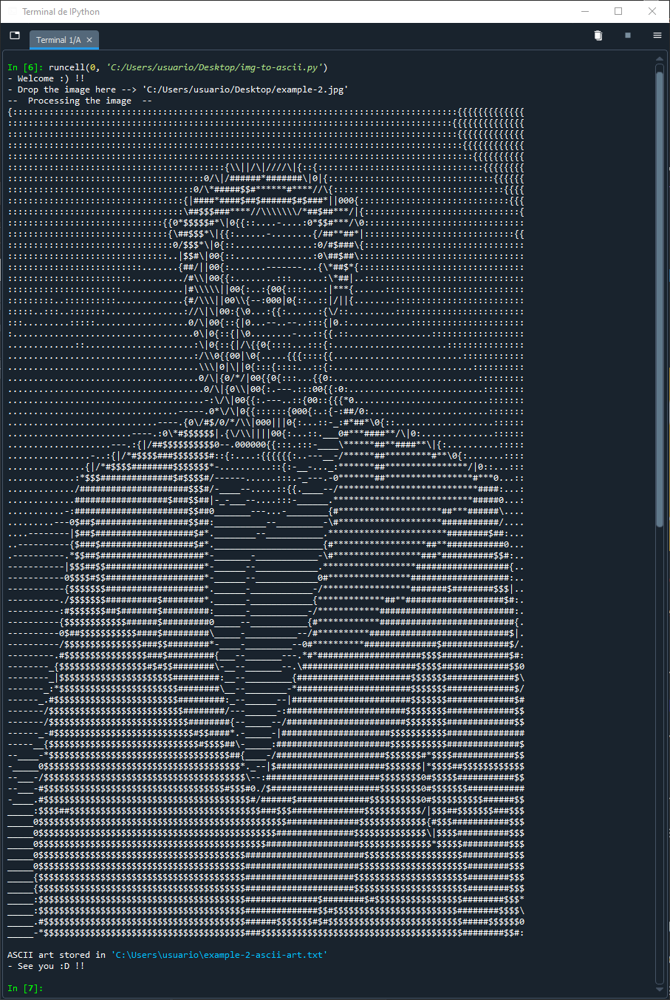
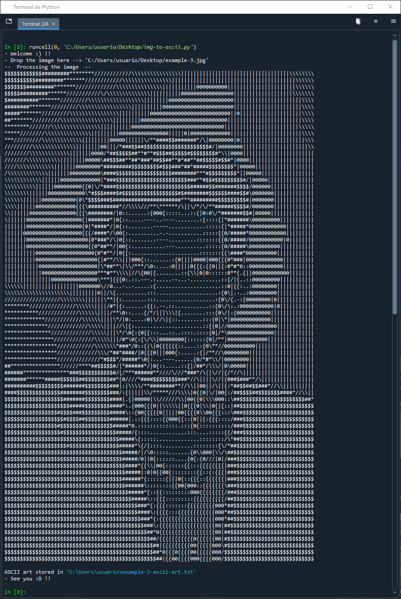

This simple Python program converts images to ASCII art.
You just need to download the file, start it, drop a file to the corresponding console and it will indicate if it works where the ASCII is saved, and the ASCII itself will appear in the console.
You can see some examples in the `examples-ascii` folder.

Examples [here](examples/):

`- Example 1 -`

This  
 
Into this  
 

`- Example 2 -`
This  
 
Into this  
 

`- Example 3 -`
This  
 
Into this  
 
